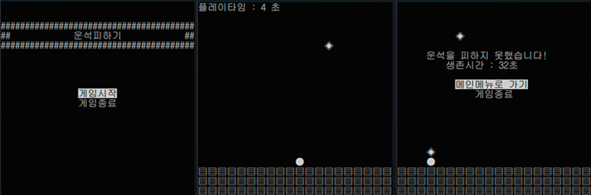
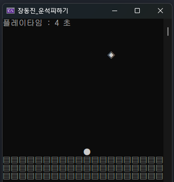
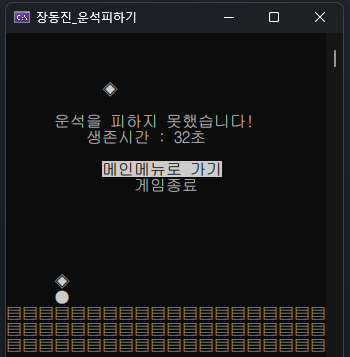

# KYA 1차 콘솔프로젝트

## 주제 운석피하기

### 게임 목표
 - 좌, 우 방향키를 활용해 상단에서 떨어지는 운석을 피해 가능한 오래 생존하는 게임
  
### 구현 목표
 - 메뉴화면과 게임화면을 각 씬처럼 동작할 수 있게 구현한다.
 - 실제 UI버튼 이미지처럼 유저에게 현재 어떤 버튼을 선택중인지 파악할 수 있게한다.
 - 프레임 값을 설정하고 해당 프레임 기반으로 화면을 출력할 수 있게 한다.
 - 창의 크기에 따라 텍스트의 위치가 변경될 수 있으므로 콘솔창의 크기를 고정한다.
 - 설정된 콘솔창의 크기는 유저 임의로 변경할 수 없게한다.
 - 운석의 출현 주기는 무작위로 생성하지만 시간대별 난이도를 구분한다.
 - 게임종료 시 다시 메뉴창으로 넘어갈지 게임을 종료할지 선택안을 제공한다.

## 구현 화면

## 개발자
 - 장동진

## 개발기간
 - 2024.07.16 ~ 2024.07.17